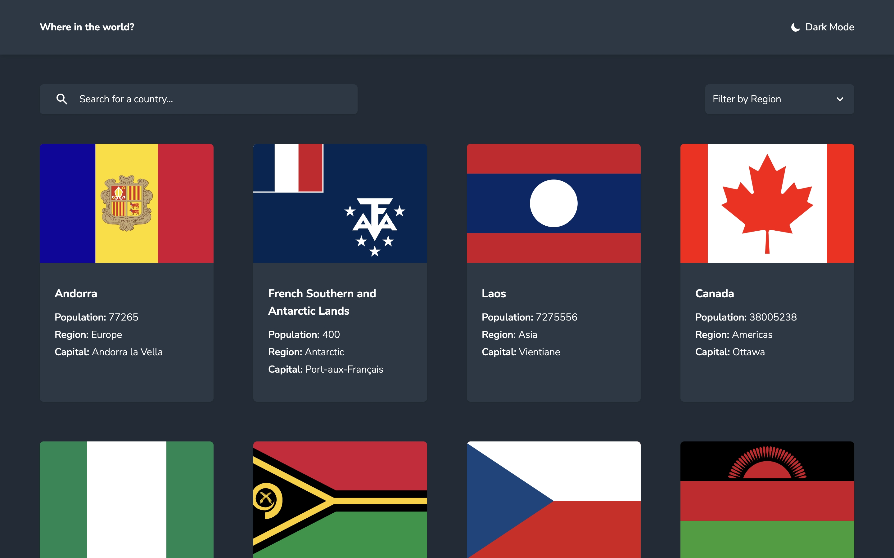
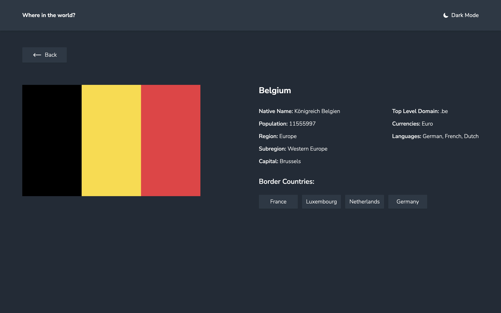
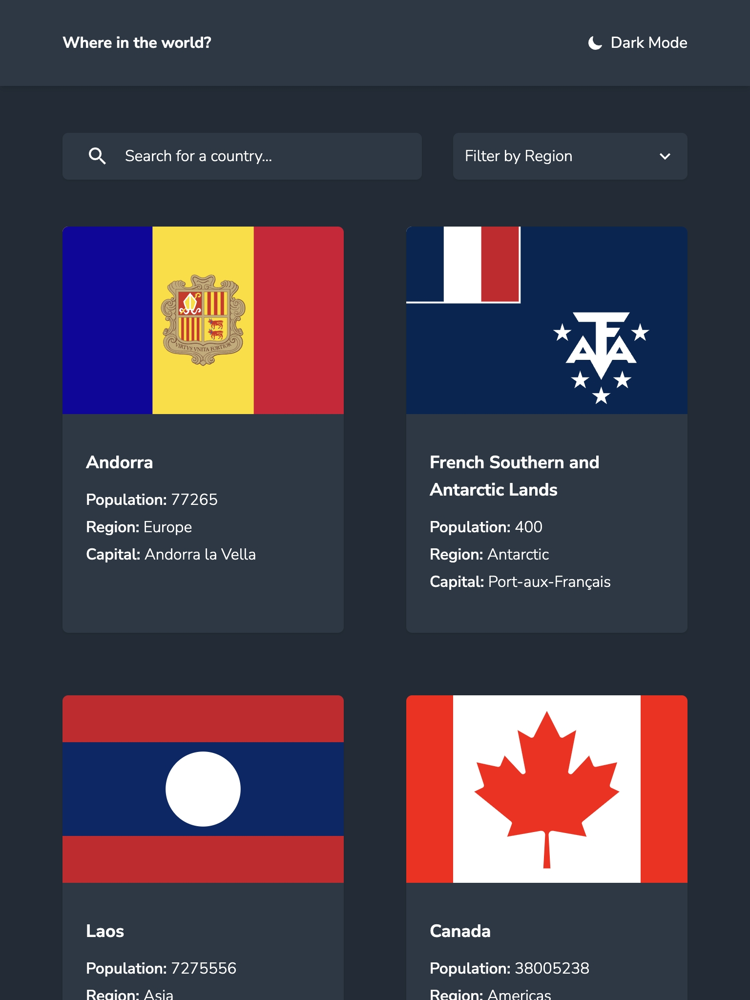
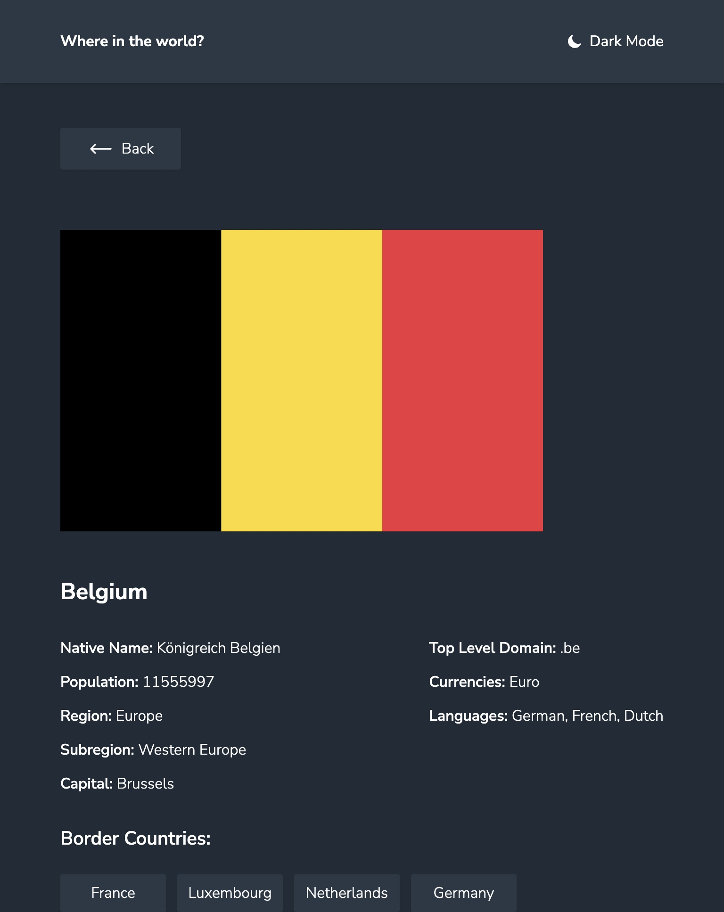
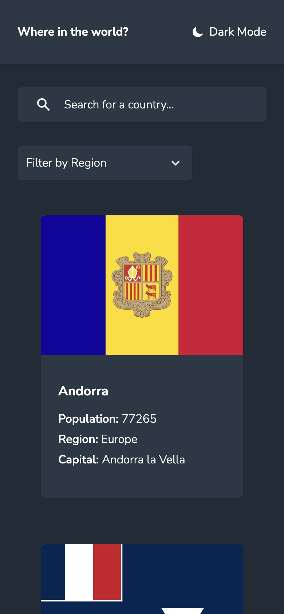
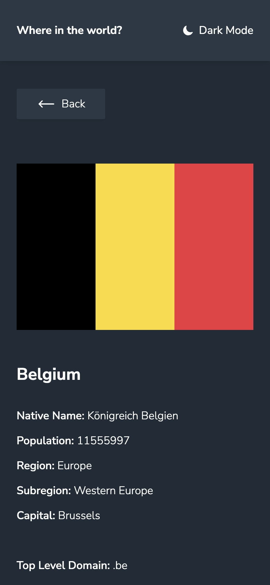

- Превью: https://rest-countries-kseylo.vercel.app/
## Установка:

Установка зависимостей
```
pnpm install
```

Запуск
```
pnpm dev
```

## Технологии которые использовал:
- HTML
- Tailwindcss
- Typescript
- Nextjs
## Скриншоты:
### ПК:
#### Главная страница:

#### Страница с деталями:

### Планшет:
#### Главная страница:

#### Страница с деталями:

### Телефон
#### Главная страница:

#### Страница с деталями:

## Проблемы с которыми столкнулся:
1.Как передать состояние поиска или фильтра в серверный компонент CountriesList для того чтобы можно было отфильтровать данные?
Решение:
```tsx
// Это часть кода из компонента поиска
// Получаем текущие параметры
const searchParams = useSearchParams()
// Получаем текущий путь
const pathname = usePathname
// Метод с помощью которого будем заменять текущий url
const { replace } = useRouter()  
const handleSearch = (query: string) => {
	// создаем новые параметры, передаем туда текущие
    const params = new URLSearchParams(searchParams)  
    if (query) {  
        params.set('query', query)  
    } else {  
        params.delete('query')  
    }  
    // меняем url
    replace(`${pathname}?${params.toString()}`)  
}
```

```tsx
// page.tsx
export default async function Home({  
    searchParams,  
}: {  
    searchParams?: { query?: string; region?: string }  
}) {
	// Получаем эти параметры в компоненте page.tsx
    const query = searchParams?.query || ''  
    const region = searchParams?.region || ''  
  
    return (  
        <main>
	        <div>  
	            <SearchCountry />  
	            <FilterByRegion />            
	        </div>  
	        <Suspense fallback={<CountriesListSkeleton />}>
		        // передаем пропсами где будем использовать  
	            <CountriesList query={query} region={region} />  
	        </Suspense>  
        </main>  
    )}
```

2. Как сделать кастомный селект?
   Решение : См. FilterByRegion.tsx, навигация стрелочками не работает. Пометка для себя: В следующий раз используй какой-нибудь headlessui.